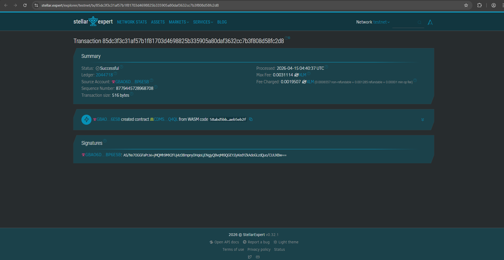

# 🏡 Stellar Land Registry — Decentralized Land Certificate System (Project Melawan Mafia Tanah)

A blockchain-based land ownership registry built on **Stellar Soroban** to prevent land mafia, duplicate certificates, and fraudulent ownership transfers. All records are stored on-chain — transparent, immutable, and tamper-proof.

---

## 🚨 Problem Statement

Land disputes in Indonesia are often caused by:
- **Duplicate land certificates** (sertifikat ganda)
- **Fraudulent ownership transfers** without the real owner's consent
- **Lack of transparent transaction history** — making it easy for land mafia to operate

This smart contract provides a decentralized, on-chain solution where every land registration and transfer is permanently recorded and publicly verifiable.

---

## ✨ Features

| Function | Description |
|---|---|
| `register_land` | Register a new land certificate — **duplicate cert_id is automatically rejected** |
| `transfer_land` | Transfer ownership to a new party with full audit trail and timestamp |
| `get_all_lands` | View all registered land records on-chain |
| `get_transfer_history` | View complete ownership history by certificate ID |
| `deactivate_land` | Flag a certificate as inactive (e.g. under legal dispute) |

---

## 🔗 Testnet Smart Contract ID

```
Contract ID: YOUR_CONTRACT_ID_HERE
Network: Stellar Testnet
```

> Replace `CDYEHMU4Z56DNV775LHDWK4PFBGBHB5QEJHLADSYMA26TQV5GV74JSJJ` with your actual contract ID after deploying via Soroban Studio.

---

## 📸 Testnet Screenshot

<!-- Replace with your actual screenshot after deploying -->


---

## 🚀 How to Use

### 1. Register a Land Certificate
Call `register_land` with the following parameters:

| Parameter | Type | Example |
|---|---|---|
| `cert_id` | String | `"SHM-001"` |
| `location` | String | `"Jl. Merdeka No.1, Jakarta"` |
| `area_sqm` | u64 | `500` |
| `owner_name` | String | `"Budi Santoso"` |
| `owner_id` | String | `"3175010101900001"` |

✅ Returns: `"Land registered successfully"`  
❌ Returns: `"ERROR: Certificate ID already registered"` if cert_id already exists

---

### 2. Transfer Ownership
Call `transfer_land` with:

| Parameter | Type | Example |
|---|---|---|
| `cert_id` | String | `"SHM-001"` |
| `new_owner_name` | String | `"Siti Rahayu"` |
| `new_owner_id` | String | `"3273010202850002"` |
| `notes` | String | `"Jual beli"` or `"Waris"` |

✅ Returns: `"Ownership transferred successfully"`  
❌ Returns: `"ERROR: Land record is inactive"` if the certificate has been deactivated

---

### 3. View All Land Records
Call `get_all_lands` — returns a list of all registered `LandRecord` objects.

---

### 4. View Transfer History
Call `get_transfer_history` with:

| Parameter | Type | Example |
|---|---|---|
| `cert_id` | String | `"SHM-001"` |

Returns all `TransferHistory` entries for that certificate, sorted chronologically.

---

### 5. Deactivate a Certificate
Call `deactivate_land` with:

| Parameter | Type | Example |
|---|---|---|
| `cert_id` | String | `"SHM-001"` |
| `reason` | String | `"Sengketa kepemilikan"` |

Once deactivated, the certificate **cannot be transferred** until reactivated by an authorized party.

---

## 🏗️ Data Structures

### `LandRecord`
```rust
pub struct LandRecord {
    pub cert_id: String,       // Unique certificate ID
    pub location: String,      // Land address / location
    pub area_sqm: u64,         // Land area in square meters
    pub owner_name: String,    // Current owner name
    pub owner_id: String,      // Owner's national ID (NIK)
    pub registered_at: u64,    // On-chain timestamp of registration
    pub is_active: bool,       // Certificate active status
}
```

### `TransferHistory`
```rust
pub struct TransferHistory {
    pub cert_id: String,       // Certificate ID
    pub from_owner: String,    // Previous owner
    pub to_owner: String,      // New owner
    pub transferred_at: u64,   // On-chain timestamp
    pub notes: String,         // Transfer notes (e.g. "Jual beli", "Waris")
}
```

---

## 🛡️ Anti-Fraud Mechanisms

1. **Duplicate Prevention** — `cert_id` is checked against all existing records before registration
2. **Immutable History** — All transfers are permanently logged with on-chain timestamps
3. **Inactive Lock** — Disputed certificates can be flagged to block any further transfers
4. **Tamper-Proof Timestamps** — Uses `env.ledger().timestamp()` which cannot be manipulated

---

## 📁 Project Structure

```
stellar-land-registry/
├── src/
│   ├── lib.rs        # Main smart contract logic
│   └── test.rs       # Unit tests (5 test cases)
├── Cargo.toml        # Project dependencies
└── README.md         # Project documentation
```

---

## 🛠️ Built With

- [Stellar Soroban](https://soroban.stellar.org/) — Smart contract platform on Stellar blockchain
- [Soroban Studio](https://stellar.org/soroban) — Browser-based IDE for writing and deploying contracts
- **Rust** (`no_std`) — Systems programming language for smart contracts


